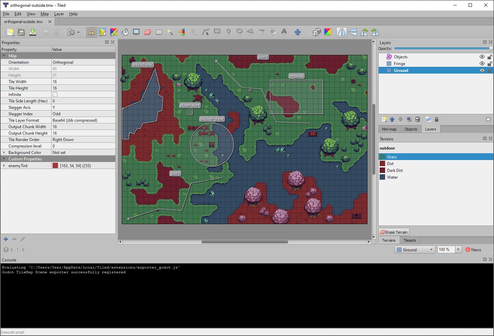
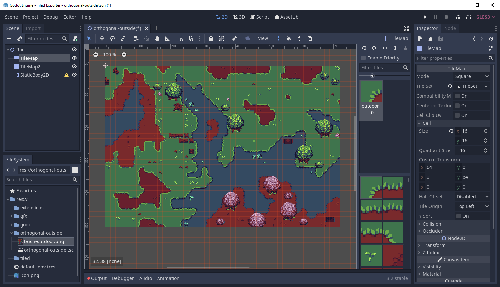

# Tiled to Godot Exporter Plugin

This is a plugin for [Tiled Map Editor](http://www.mapeditor.org/) to export tilemaps and tilesets as [Godot Engine](https://godotengine.org/) scene files.
It uses [JavaScript API](https://doc.mapeditor.org/en/stable/reference/scripting/) available in [Tiled](http://www.mapeditor.org/) v1.3 and newer.

## Instalation

Copy file [exporter_godot.js](extensions/exporter_godot.js) to your Tiled extensions directory.

* Windows: `%APPDATA%/Local/Tiled/extensions/`
* MacOS: `~/Library/Preferences/Tiled/extensions/`
* Linux: `~/.config/tiled/extensions/`

## Requirements

* ___Tiled Map Editor v1.3___ or newer https://www.mapeditor.org/
* ___Godot Engine v3.0___ or newer https://godotengine.org/

## Notes

This is early __ALPHA__ version.

* only orthogonal, fixed size maps are supported
* you'll propably need to fix invalid textures paths during import
* collision layers and shapes are not exported yet

## License

[MIT License](LICENSE)

